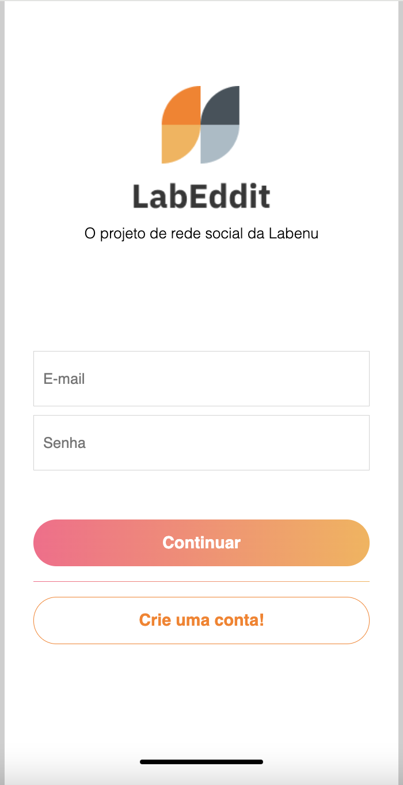

# Projeto LabEddit - Frontend

## Link do front-end deployado
https://labeddit-fullstack-kanone.surge.sh/

## Link do back-end deployado
https://labeddit-backend-kanone.onrender.com

## Link do repositório do back-end do projeto LabEddit full stack
https://github.com/leonardocanone/projeto-labeddit-backend

## Documentação da API
https://documenter.getpostman.com/view/30031982/2sA3XMjPei

## Contas e senhas já criadas
Utilize os usuários abaixo caso não queira criar uma nova conta:
  
leonardev@email.com
 
leonardev123
  
persefone@email.com
 
persefone123
  
anna@email.com
 
anna123
  
astrodev@email.com
 
astrodev99

## Instalação e Inicialização 
1. Ter o **node.js e o pacote npm** instalados e rodar o comando **npm install**
2. Para rodar o projeto localmente digite o comando **npm run start**

## Descrição do projeto

O Labbedit trata-se do projeto full stack de conclusão de curso do bootcamp da Labenu. O projeto consiste em uma rede social na qual é possível cadastrar uma conta de usuário, fazer o login, criar, editar ou excluir postagens e comentários. Também é possível dar like ou dislike nos posts e comentários criados pelos usuários da plataforma.

O projeto LabEddit possui quatro páginas:

- **Página de Login**: Nesta página o usuário deverá digitar seu e-mail e senha previamente cadastrados, e se houver algum erro de digitação nos dados, o usuário será informado. Caso ainda não tenha cadastro, basta clicar no botão **"Crie uma conta!"** 

- **Página de Cadastro de Usuário**: Nesta página o usuário poderá criar uma conta na LabEddit e para isso deverá fornecer um nome, um e-mail válido e definir uma senha de no mínimo 5 caracteres. Também será necessário concordar com os termos e com a Política de Privacidade da rede. Em caso de não cumprimento dos requisitos do cadastro, o usuário será informado na tela, e estando tudo certo, a conta será criada e o usuário será direcionado direto para o Feed.

- **Página de Feed**: Na página de Feed o usuário poderá criar suas postagens, bem como poderá visualizar os posts dos demais usuários presentes na rede, e também é possível dar um like ou um dislike em cada post. O usuário terá total controle sobre suas postagens, podendo editá-las ou excluí-las a qualquer momento. Cada post possui o nome do usuário que o criou, a quantidade de likes, bem como o número de comentários. Havendo comentários, para vê-los basta clicar no corpo da postagem, e o usuário será direcionado para a Comments Page. No canto direito do cabeçalho, o usuário poderá fazer o Logout. 

- **Página de Comentários**: Nesta página os usuários poderão interagir em uma postagem específica fazendo comentários, seguindo o formato de uma "thread". Será possível visualizar todos os comentários realizados nesse post, tanto do usuário logado quanto dos demais usuários da rede. Também será possível editar ou excluir seus comentários. Por fim, igualmente na feedpage, no lado direito do cabeçalho será possível fazer o Logout da LabEddit, entretanto no lado esquerdo há um botão que permite ao usuário retornar para a página de Feed.   

 

Abaixo temos todas as funcionalidades oferecidas pela plataforma aos seus usuários:
- Cadastro de usuário
- Login de usuário
- Logout de usuário
- Criação de post
- Edição de post
- Deleção de post
- Criação de comentário
- Edição de comentário
- Deleção de comentário
- Curtir post
- Descurtir post
- Curtir comentário
- Descurtir comentário

## Tecnologias e ferramentas utilizadas

- Javascript
- ReactJS
- Axios
- Styled-Components
- Figma

## Imagens das telas do projeto
Este projeto web seguiu o conceito **mobile first**, o qual prioriza a experiência para dispositivos móveis.

### Login Page

### Signup Page

### Feed Page (posts)

### Comments Page

## Requisitos do projeto

- [ ] Respeitar o layout do Figma
- [ ] Uso do ReactJS
- [ ] Site deployado
- [ ] Documentação README

## Desenvolvedor
Este projeto foi desenvolvido por:

**Leonardo Canone** : [LinkedIn](https://www.linkedin.com/in/leonardocanone/) | [GitHub](https://github.com/leonardocanone)
